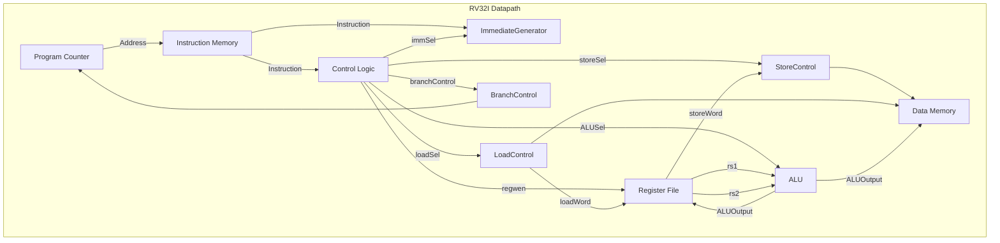

```mermaid
flowchart TD
    subgraph RV32I Datapath
        PC[Program Counter] -->|Address| IMEM[Instruction Memory]
        IMEM -->|Instruction| IDECODE[Control Logic]
        IMEM --> |Instruction|IMM
        IDECODE --> |immSel| IMM[ImmediateGenerator]
        IDECODE -->|regwen| REGFILE
        IDECODE -->|ALUSel| ALU
        IDECODE --> |storeSel| STR
        IDECODE --> |loadSel| LOAD
        IDECODE --> |branchControl| BR
        STR[StoreControl] --> DMEM[Data Memory]
        LOAD[LoadControl] --> DMEM[Data Memory]
        REGFILE[Register File] -->|rs1| ALU
        REGFILE -->|rs2| ALU
        ALU -->|ALUOutput| DMEM
        ALU -->|ALUOutput| REGFILE
        REGFILE --> |storeWord| STR
        LOAD --> |loadWord| REGFILE
        BR[BranchControl] --> PC
    end
```