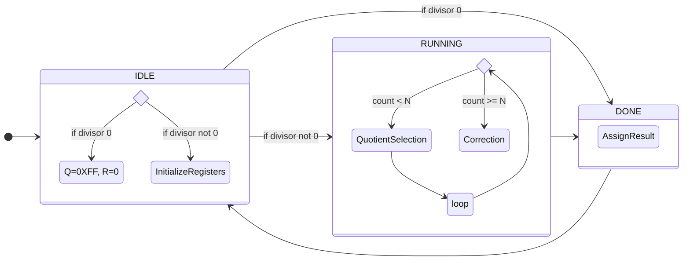
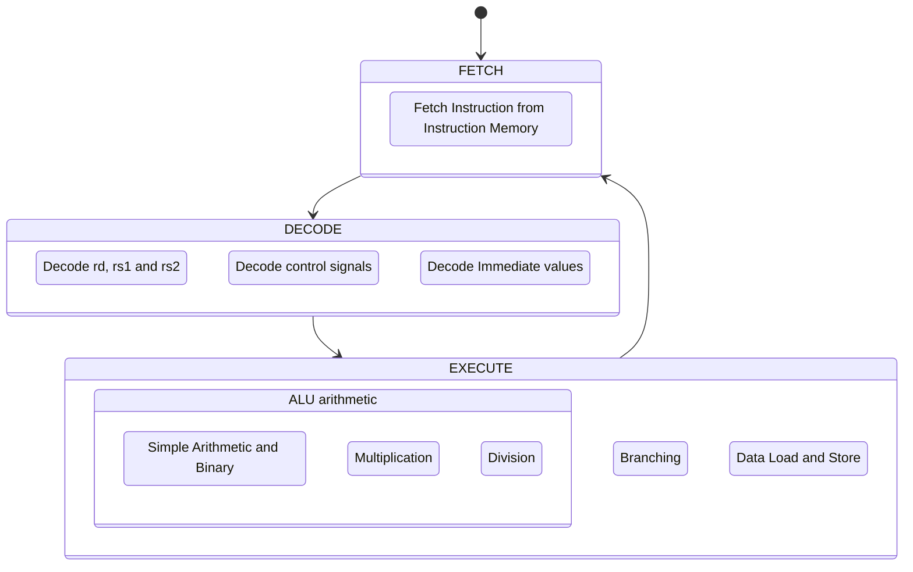

```mermaid
stateDiagram-v2
    [*] --> IDLE
    state IDLE {
        state if_state <<choice>>
        state "Q=0XFF, R=0" as set
        if_state --> set: if divisor 0
        if_state --> InitializeRegisters: if divisor not 0
    }

    IDLE --> DONE: if divisor 0
    IDLE-->RUNNING: if divisor not 0
    state RUNNING {
        state if_state_1 <<choice>>
        loop --> if_state_1
        if_state_1 --> QuotientSelection: count < N
        QuotientSelection--> loop
        if_state_1 --> Correction: count >= N
    }

    RUNNING-->DONE
    state DONE {
        AssignResult
    }
    direction LR
    DONE-->IDLE
    
```

```mermaid
stateDiagram-v2
    [*]-->FETCH
    state FETCH {
        state "Fetch Instruction from Instruction Memory" as fetch
    }

    FETCH --> DECODE
    state DECODE {
        state "Decode rd, rs1 and rs2" as insdecode
        state "Decode control signals" as Ctrl
        state "Decode Immediate values" as imm
    }
    DECODE-->EXECUTE 
    EXECUTE --> FETCH
    state EXECUTE {
        state "ALU arithmetic" as ALU
        state "Branching" as branch
        state "Data Load and Store" as data
    }

    state ALU {
        state "Simple Arithmetic and Binary" as arith
        Multiplication
        Division
    }
```