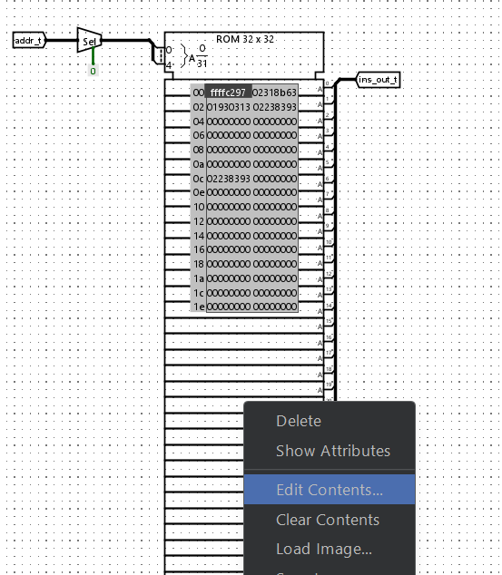

# RV32I on Logisim

Logisim is a digital circuit simulation tool used to simulate advanced digital circuits. We use logisim to simulate our RV32I base instruction set core.

This simulation was made possible by the [series of videos](https://www.youtube.com/watch?v=dVBh6-hLXNI) made available on Youtube by the content creator *Chuck's Tech Talk*. This series greatly helped enhance my understanding of a RISC-V core. Although the series is incomplete, I have filled in the missing gaps to provide a complete RISC-V core.

## Setup

### Install logisim-evolution

- Install logisim-evolution from [here](https://github.com/logisim-evolution/logisim-evolution/releases) based on your architecture and OS
- Windows 11 on x86 was used for this project

### Clone the repository

- Clone [this](https://github.com/ak47av/Logisim_RISCV) git repository to your local machine.

## Run the simulation
### Open the project
- Open logisim-evolution
- Click File->Open and navigate to the cloned repository and select the file "RV32I.circ"

### Running the simulation
The RV32I core has two customizable components

**Instruction memory**: 
The instruction memory contains the instructions that the CPU runs in binary format.
- This must be initialized by using the *load_instructions.py* Python program
- Skip this step if you don't wish to load your own program.
    - Assemble your RV32I program on the [Venus simulator](https://venus.cs61c.org/)
    - Write your assembly program in the venus editor tab
    - In the simulator tab, click Assemble and Simulate from Editor
    - You can run the program and view the results on the right side of the page
    - Select the Dump option and copy the output in the text box below the program disassembly
    - Paste the output in the *instruction_memory.txt* file and also remove the hexadecimal initializer sequence "0x" from all the lines. Refer to the same file in the cloned repository for the format required.
- Run *load_instructions.py* and you should have a *instruction.rom* file.
- To load the rom file in logisim
    - Double click the *InstructionMemory* block in the explorer on the left
    - Right click on the ROM module and select Edit contents 
    - Select *Open..* in the Hex editor that opens
    - Select the instruction.rom file
    - Close the hex editor window

**ControlLogic**: The ControlLogic module is responsible for controlling the various blocks of the processor to execute the instructions we issued.

- **DO NOT** edit the *tt.csv* file. This file contains the mappings between the instruction and the control signals.
- Run the buildrom.py file and you should have a *logic.rom* file.
- Similar to the previous instruction memory, edit its contents and load *logic.rom* into the ROM.

To run the simulation 
- Click on the simulate tab
- Click on the button below that says "Tick clock one full cycle" when you hover on it
- You can double click on any block to view its contents while ticking the clock
- Double click the *Registers* block to view the contents of the Registers inside the core
- The contents of the registers must change according to the instructions executed
